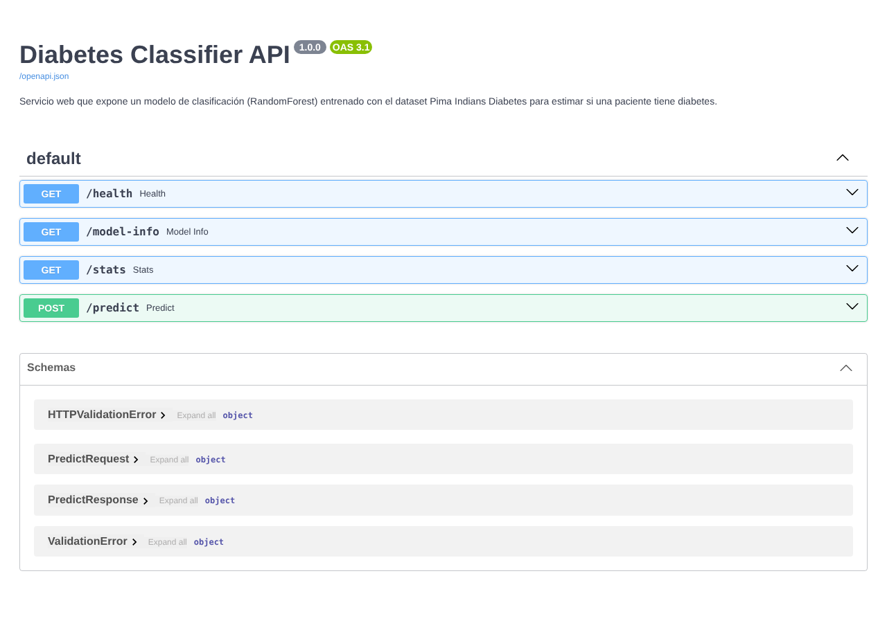
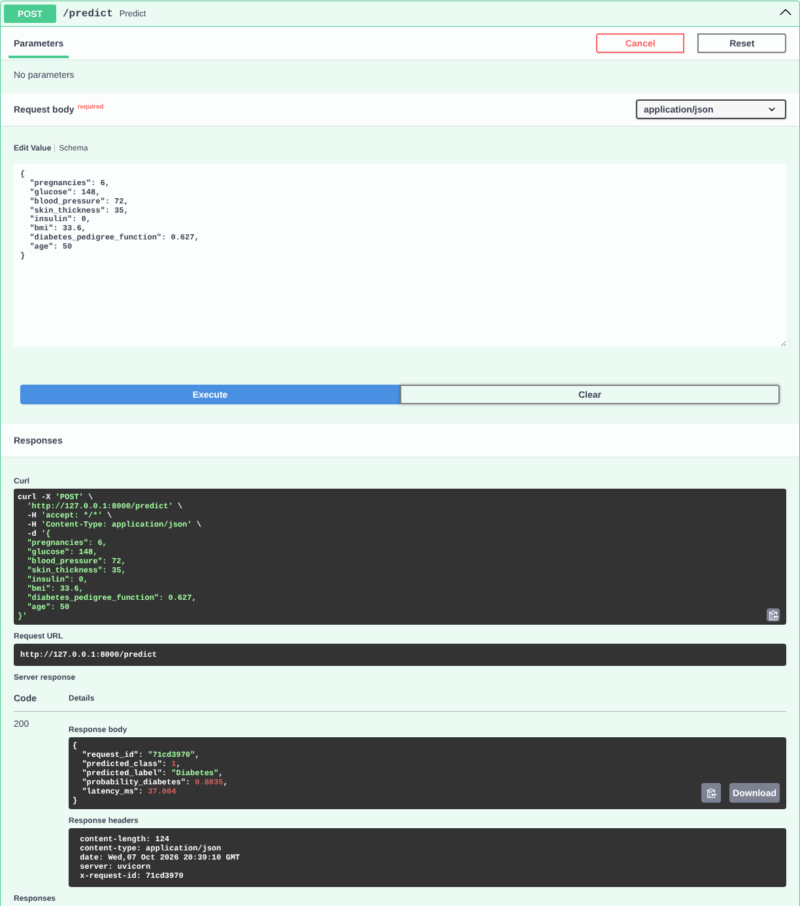
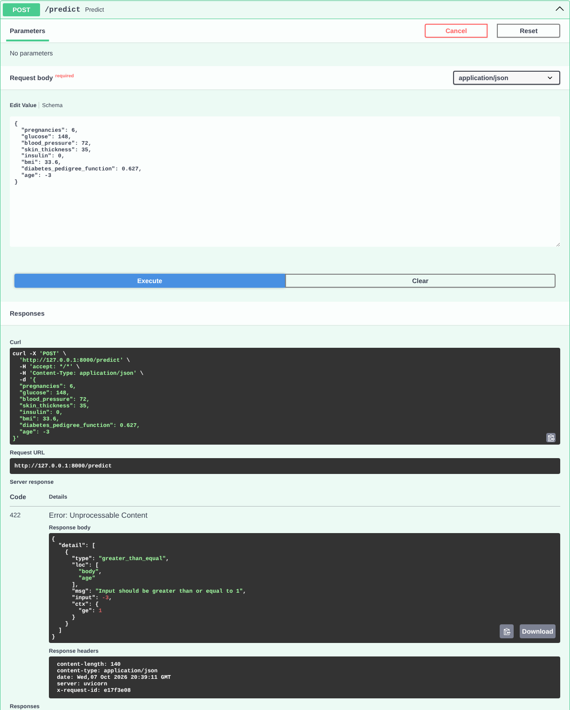

# Despliegue de un modelo de clasificación como servicio web con FastAPI


**Integrantes del grupo:**
- Jeimmy Patricia Valderrama Vásquez
- Daniel Felipe Tristancho Monroy
- Samuel Felipe González Vargas
- Valentina Moncada Ibáñez
- Javier Ricardo Cely Pérez

## Objetivo

Desplegar un modelo de clasificación como un servicio web accesible vía API REST, permitiendo su integración con otras aplicaciones y asegurando su correcto funcionamiento mediante pruebas y monitoreo.

## Caso de estudio

Dataset **Pima Indians Diabetes** (768 pacientes, 8 variables clínicas; fuente: [jbrownlee/Datasets](https://github.com/jbrownlee/Datasets)). El modelo estima si una paciente tiene diabetes (`Outcome = 1`) o no (`0`).

- **Modelo:** `Pipeline` de scikit-learn = imputación de ceros (mediana) + `RandomForestClassifier`.
- **Preprocesamiento dentro del pipeline:** en glucosa, presión, pliegue cutáneo, insulina y BMI un `0` significa "no medido". Al ir dentro del `Pipeline`, la API aplica exactamente el mismo tratamiento que el entrenamiento.
- **Desempeño (test 20 %):** accuracy 0.73 · F1 (clase diabetes) 0.67 · ROC-AUC 0.82 — valores típicos para este dataset pequeño y ruidoso.

## Estructura del repositorio

```
.
├── app/
│   ├── main.py              # API FastAPI (/health, /model-info, /stats, /predict)
│   ├── logging_config.py    # Logging a consola y a logs/api.log
│   ├── train_model.py       # Entrena y serializa el modelo
│   └── model/               # model.joblib + metadata.json
├── data/diabetes.csv        # Dataset con encabezados
├── notebooks/               # Notebook de Colab que documenta el proceso
├── tests/
│   ├── test_api_curl.sh         # Batería de pruebas con curl
│   └── postman_collection.json  # Misma batería para Postman
├── logs/api.log             # Log real generado durante las pruebas
├── screenshots/             # Capturas (Swagger UI) y salida de curl
├── requirements.txt
└── README.md
```

## 1. Ejecutar el servicio

```bash
pip install -r requirements.txt
python app/train_model.py                           # opcional: el modelo ya viene incluido
uvicorn app.main:app --host 0.0.0.0 --port 8000
```

Documentación interactiva (Swagger UI): <http://localhost:8000/docs>

## 2. Endpoints

| Método | Ruta | Descripción |
|---|---|---|
| `GET` | `/health` | Estado del servicio y si el modelo está cargado |
| `GET` | `/model-info` | Metadatos del modelo (variables, clases, métricas) |
| `GET` | `/stats` | Monitoreo básico: solicitudes, errores 4xx/5xx, predicciones por clase, latencia promedio |
| `POST` | `/predict` | Recibe las 8 variables clínicas y devuelve la clase predicha y su probabilidad |

Solicitud a `/predict` (los campos en `0` se interpretan como "no medido"):

```bash
curl -X POST http://localhost:8000/predict -H "Content-Type: application/json" -d '{
  "pregnancies": 6, "glucose": 148, "blood_pressure": 72, "skin_thickness": 35,
  "insulin": 0, "bmi": 33.6, "diabetes_pedigree_function": 0.627, "age": 50
}'
```

Respuesta:

```json
{"request_id":"3a7da2ac","predicted_class":1,"predicted_label":"Diabetes","probability_diabetes":0.8035,"latency_ms":47.335}
```

La entrada se valida con **Pydantic** (tipos y rangos clínicos); una solicitud inválida devuelve `422` con el campo que falló.

## 3. Pruebas (curl / Postman / Swagger)

Se ejecutó la batería de `tests/test_api_curl.sh` contra el servicio real (salida completa en `screenshots/curl_test_output.txt`). La misma batería está en `tests/postman_collection.json` (*File → Import* en Postman; variable `base_url`).

| # | Prueba | Resultado obtenido |
|---|---|---|
| 1 | `GET /health` | `200` · `{"status":"ok","model_loaded":true}` |
| 2 | `GET /model-info` | `200` · metadatos y métricas del modelo |
| 3 | `POST /predict` riesgo alto | `200` · **Diabetes**, p = 0.8035 |
| 4 | `POST /predict` riesgo bajo | `200` · **Sin diabetes**, p = 0.1266 |
| 5 | `POST /predict` con valores 0 (no medidos) | `200` · imputados con la mediana, p = 0.5923 |
| 6 | `POST /predict` edad = -3 | `422` · `age` debe ser ≥ 1 |
| 7 | `POST /predict` sin `bmi` | `422` · campo requerido |
| 8 | `POST /predict` con `glucose = "alta"` | `422` · no es un número |
| 9 | `GET /stats` | `200` · 9 solicitudes, 3 errores 4xx, 0 errores 5xx |

### Capturas de pantalla (carpeta `screenshots/`)

| Archivo | Contenido |
|---|---|
| `01_swagger_endpoints.png` | Swagger UI con los endpoints documentados automáticamente |
| `02_predict_valido.png` | `POST /predict` válido ejecutado desde Swagger → `200` |
| `03_predict_error_422.png` | `POST /predict` con edad = -3 → `422` |
| `04_stats.png` | Endpoint `/stats` de monitoreo |
| `curl_test_output.txt` | Salida completa de la batería con curl |





## 4. Registro y monitoreo básico

**Logging (`logs/api.log`).** Cada solicitud queda registrada con un `request_id` único (el mismo que devuelve el encabezado `X-Request-ID`), la entrada, la predicción, el código HTTP y la latencia. Las entradas inválidas se registran como `WARNING` y las excepciones no controladas como `ERROR` con su traceback (el cliente recibe un `500` genérico sin detalles internos).

```
INFO    | [3a7da2ac] POST /predict
INFO    | [3a7da2ac] predicción OK: input={'pregnancies': 6, 'glucose': 148.0, ...} -> Diabetes (p_diabetes=0.804)
INFO    | [3a7da2ac] status=200 tiempo=49.44ms
WARNING | [980986c3] Entrada inválida -> ['body.age: Input should be greater than or equal to 1']
INFO    | [980986c3] status=422 tiempo=0.90ms
```

**Monitoreo (`GET /stats`).** Contadores desde el arranque: total de solicitudes, errores 4xx/5xx, predicciones por clase y latencia promedio. Un aumento de 4xx indica clientes enviando datos incorrectos; un aumento de 5xx, fallas del propio servicio.

## 5. Notebook de Google Colab

`notebooks/Despliegue_FastAPI_Diabetes_Grupo4.ipynb` documenta el proceso completo: EDA del dataset, entrenamiento y evaluación, escritura de los archivos de la API, levantamiento del servicio con `uvicorn`, pruebas con curl, capturas, revisión del log y de `/stats`. Es autosuficiente (no depende de los demás archivos del repositorio) y el código es el mismo de este repositorio.

[](https://colab.research.google.com/github/javiercely01-cpu/diabetes-classifier-fastapi/blob/main/notebooks/Despliegue_FastAPI_Diabetes_Grupo4.ipynb)

## Conclusiones y limitaciones

- El modelo quedó desplegado como servicio REST reproducible, con documentación automática, validación de entrada, logging y monitoreo básico.
- Las pruebas confirmaron respuestas correctas en los casos válidos y rechazo controlado (`422`) de entradas inválidas, sin afectar la disponibilidad.
- Limitaciones: el modelo es didáctico (sin ajuste de hiperparámetros); los contadores de `/stats` viven en memoria; no hay autenticación. En producción se añadirían autenticación, métricas con Prometheus/Grafana y un contenedor Docker.
